# Klassrumsskärm – Lärarhandbok

En steg-för-steg-guide för lärare som vill använda **Klassrumsskärm** i undervisningen.

Klassrumsskärm är ett webbaserat verktyg som förvandlar din projektorskärm eller smartboard till en flexibel digital tavla. Du kan lägga till klockor, timers, text, bilder, symboler och mycket mer – och anpassa allt efter lektionens behov.

---

## Innehåll

1. [Kom igång](#1-kom-igång)
2. [Översikt av gränssnittet](#2-översikt-av-gränssnittet)
3. [Menyerna](#3-menyerna)
4. [Hantera verktyg (widgets)](#4-hantera-verktyg-widgets)
5. [Verktyg – detaljerad guide](#5-verktyg--detaljerad-guide)
6. [Skriva – detaljerad guide](#6-skriva--detaljerad-guide)
7. [Media – detaljerad guide](#7-media--detaljerad-guide)
8. [Symboler – detaljerad guide](#8-symboler--detaljerad-guide)
9. [System – detaljerad guide](#9-system--detaljerad-guide)
10. [Flera skärmar](#10-flera-skärmar)
11. [Spara och återanvända](#11-spara-och-återanvända)
12. [Tips för klassrummet](#12-tips-för-klassrummet)

---

## 1. Kom igång

### Steg 1: Öppna appen

Öppna `index.html` i en webbläsare (Chrome, Edge eller Firefox rekommenderas). Appen fungerar direkt – ingen installation krävs.

### Steg 2: Bekanta dig med startvyn

När appen startar ser du en bakgrundsbild och två menyrader längst ner på skärmen.

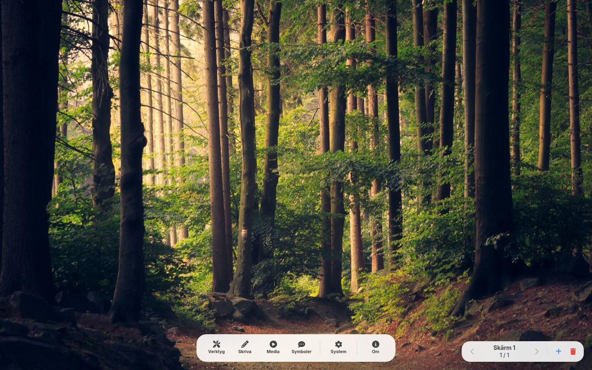

- **Nedre mitten:** Huvudmenyn med alla verktyg
- **Nedre höger:** Skärmnavigering (för att växla mellan olika sidor)

### Steg 3: Lägg till ditt första verktyg

1. Klicka på **Verktyg** i huvudmenyn
2. Välj till exempel **Klocka**
3. Verktyget visas på skärmen och kan flyttas och anpassas

---

## 2. Översikt av gränssnittet

### Huvudmenyn

Huvudmenyn innehåller sex kategorier:

| Meny | Syfte |
|------|-------|
| **Verktyg** | Tid, ljud, slumpning och tärningar |
| **Skriva** | Text, att-göra-listor och schema |
| **Media** | Bilder, video, PDF, Spotify och YouTube |
| **Symboler** | Visuella instruktioner och bildstöd |
| **System** | Bakgrund, helskärm, spara och ladda |
| **Om** | Information om appen |

### Skärmnavigering

Längst ner till höger hittar du kontroller för att hantera flera skärmar (sidor):

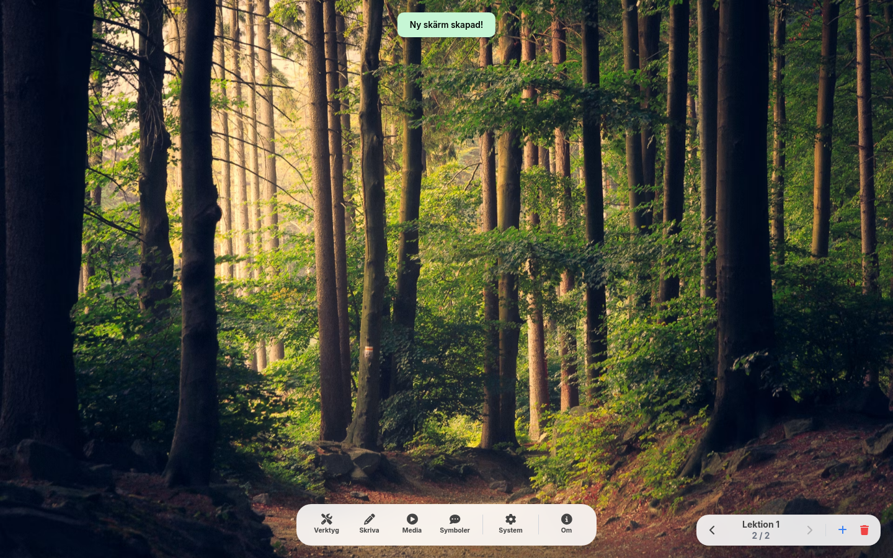

| Knapp | Funktion |
|-------|----------|
| **◀ ▶** | Växla mellan skärmar |
| **Namnfält** | Ge skärmen ett namn (t.ex. "Lektion 1") |
| **1 / 2** | Visar vilken skärm du är på |
| **+** | Skapa en ny skärm |
| **🗑** | Ta bort aktuell skärm |

---

## 3. Menyerna

Klicka på en menyknapp för att öppna dess undermeny. Klicka utanför menyn eller välj ett alternativ för att stänga den.

### Verktyg

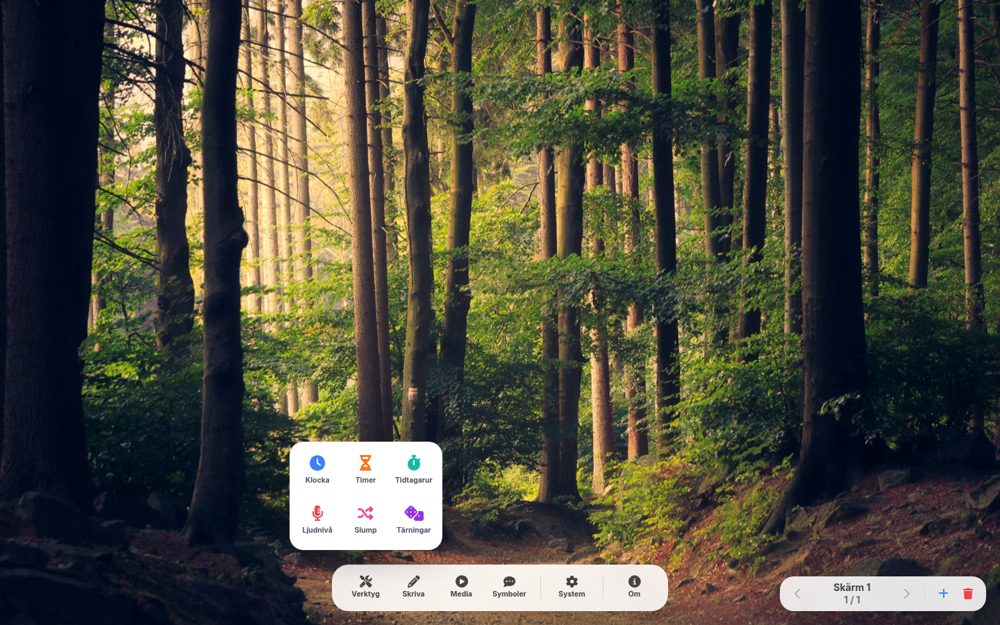

| Verktyg | Beskrivning |
|---------|-------------|
| **Klocka** | Digital eller analog klocka |
| **Timer** | Nedräkningstimer med visuell cirkel |
| **Tidtagarur** | Stoppur för att mäta tid |
| **Ljudnivå** | Visar klassrummets ljudnivå via mikrofon |
| **Slump** | Slumpar elevnummer eller skapar grupper |
| **Tärningar** | Virtuella tärningar (1–6 st) |

### Skriva

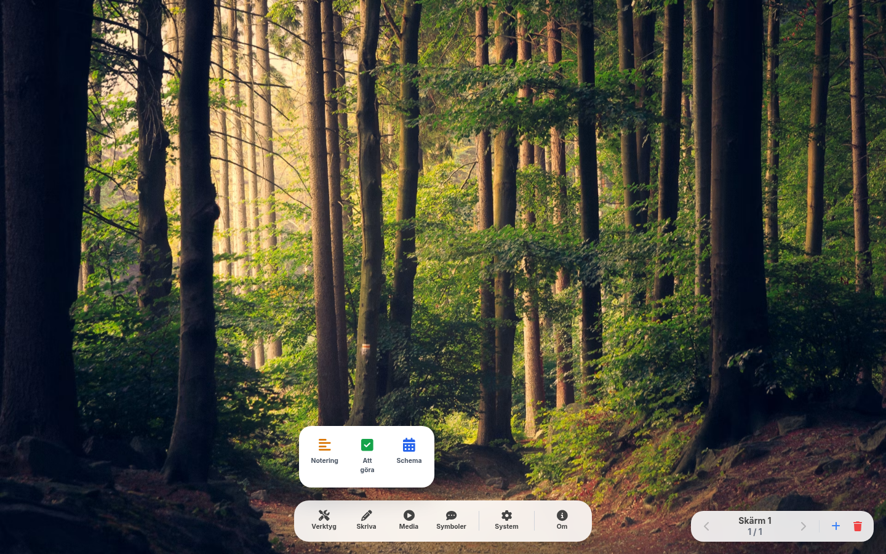

| Verktyg | Beskrivning |
|---------|-------------|
| **Notering** | Textfält med formateringsverktyg |
| **Att göra** | Checklista för uppgifter |
| **Schema** | Dags- eller lektionsschema med tider |

### Media

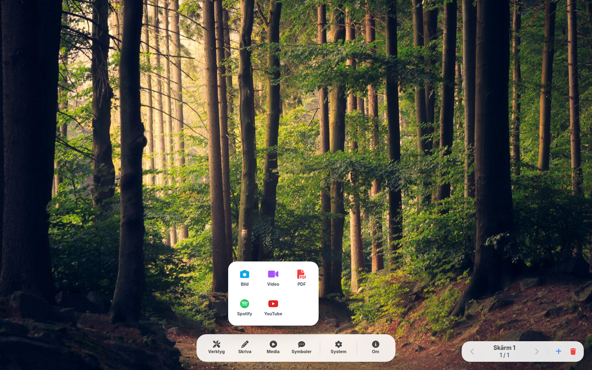

| Verktyg | Beskrivning |
|---------|-------------|
| **Bild** | Visa en bild från din dator |
| **Video** | Spela upp en videofil |
| **PDF** | Visa ett PDF-dokument |
| **Spotify** | Bädda in musik från Spotify |
| **YouTube** | Bädda in en YouTube-video |

### Symboler

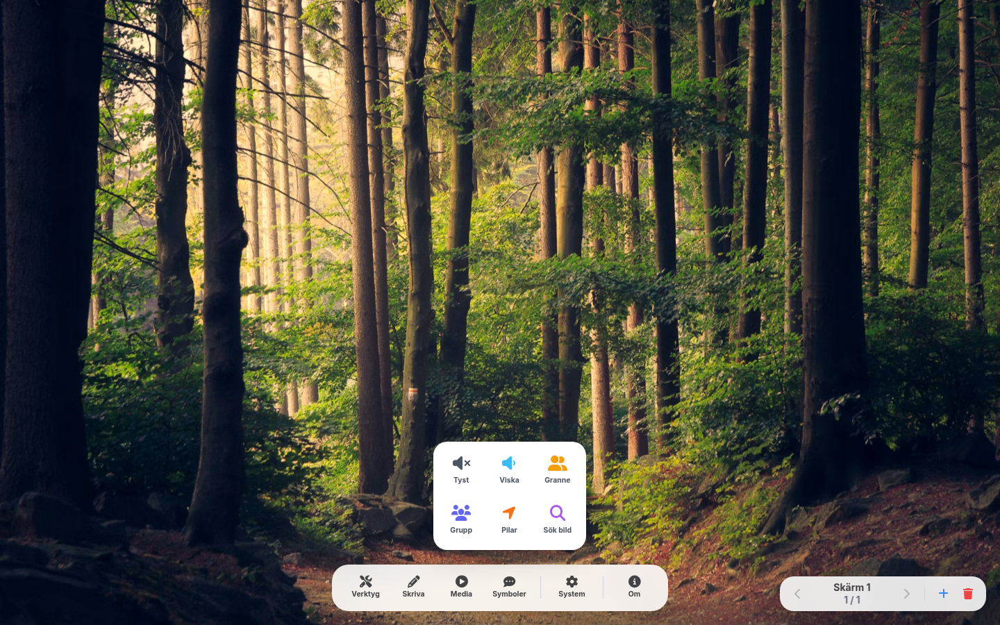

| Verktyg | Beskrivning |
|---------|-------------|
| **Tyst** | Symbol för tyst arbete |
| **Viska** | Symbol för viskning |
| **Granne** | Symbol för att prata med granne |
| **Grupp** | Symbol för grupparbete |
| **Pilar** | Riktade pilar för att peka ut saker |
| **Sök bild** | Sök bildstöd från ARASAAC |

### System

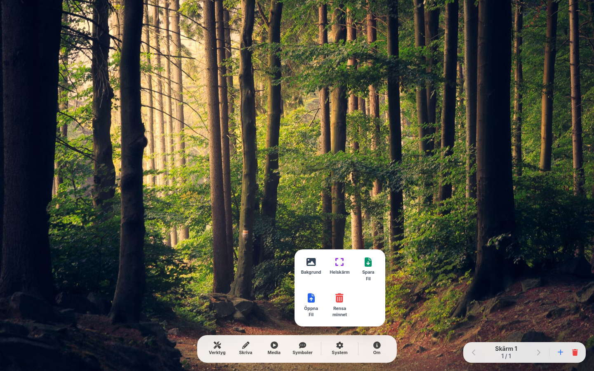

| Funktion | Beskrivning |
|----------|-------------|
| **Bakgrund** | Ändra bakgrundsbild eller färg |
| **Helskärm** | Visa appen i helskärmsläge |
| **Spara Fil** | Exportera din layout till en fil |
| **Öppna Fil** | Importera en sparad layout |
| **Rensa minnet** | Radera allt och börja om från början |

### Om

Klicka på **Om** för att se information om appen, vem som skapat den och användarvillkor.

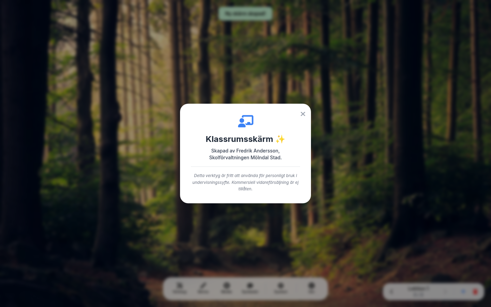

---

## 4. Hantera verktyg (widgets)

Varje verktyg du lägger till kallas ett **widget**. Alla widgets kan flyttas, ändras i storlek och anpassas.

### Markera ett verktyg

Klicka på ett verktyg för att markera det. En blå ram visas runt verktyget och en **verktygsrad** dyker upp ovanför.

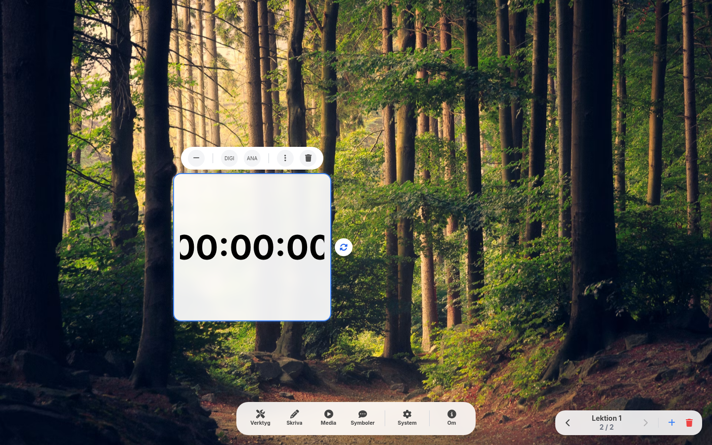

### Verktygsradens knappar

| Knapp | Funktion |
|-------|----------|
| **−** | Fäll in verktyget (visar bara en liten ikon) |
| **⋮** | Öppna stilmeny – välj bakgrundsfärg |
| **🗑** | Ta bort verktyget |
| **↻** (blå cirkel) | Rotera verktyget fritt |

Vissa verktyg har extra knappar i verktygsraden, till exempel:
- **Klocka:** DIGI / ANA – växla mellan digital och analog visning
- **Notering:** Pil uppåt – dölj/visa textverktygsraden
- **Pil:** Form, animation och färgval

### Flytta ett verktyg

1. Klicka på verktyget för att markera det
2. Dra verktyget till önskad position
3. Släpp musknappen

### Ändra storlek

1. Markera verktyget
2. Dra i kanterna eller hörnen (små osynliga handtag runt verktyget)
3. Släpp när storleken är lagom

### Rotera

1. Markera verktyget
2. Dra i den blå cirkeln med uppdateringsikonen (↻) till höger om verktyget
3. Släpp när vinkeln är rätt

### Ändra bakgrundsfärg på verktyget

1. Markera verktyget
2. Klicka på **⋮** (tre prickar) i verktygsraden
3. Välj en färg – eller transparent för att bara visa innehållet

### Exempel på en färdig layout

Här är ett exempel på hur flera verktyg kan kombineras på en skärm:

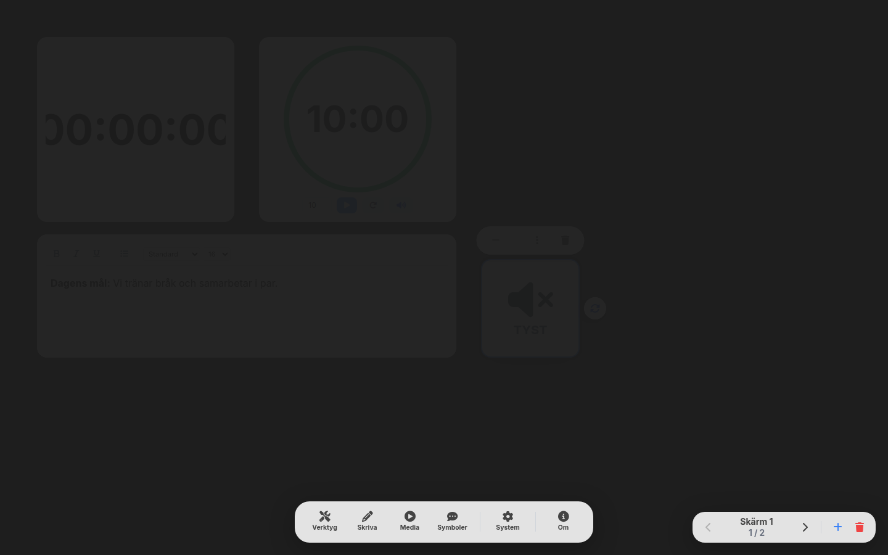

---

## 5. Verktyg – detaljerad guide

### Klocka

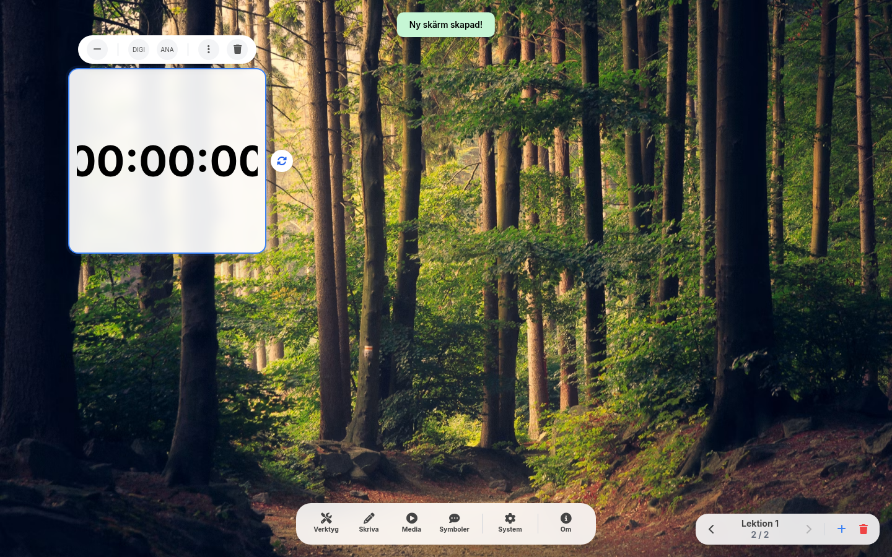

**Användning:** Visa aktuell tid för eleverna.

**Så här gör du:**
1. Verktyg → Klocka
2. Klockan visas i digitalt läge (00:00:00)
3. Klicka **ANA** i verktygsraden för analog klocka
4. Klicka **DIGI** för att gå tillbaka till digital visning

**Tips:** Använd den analoga klockan när eleverna ska öva tid.

---

### Timer

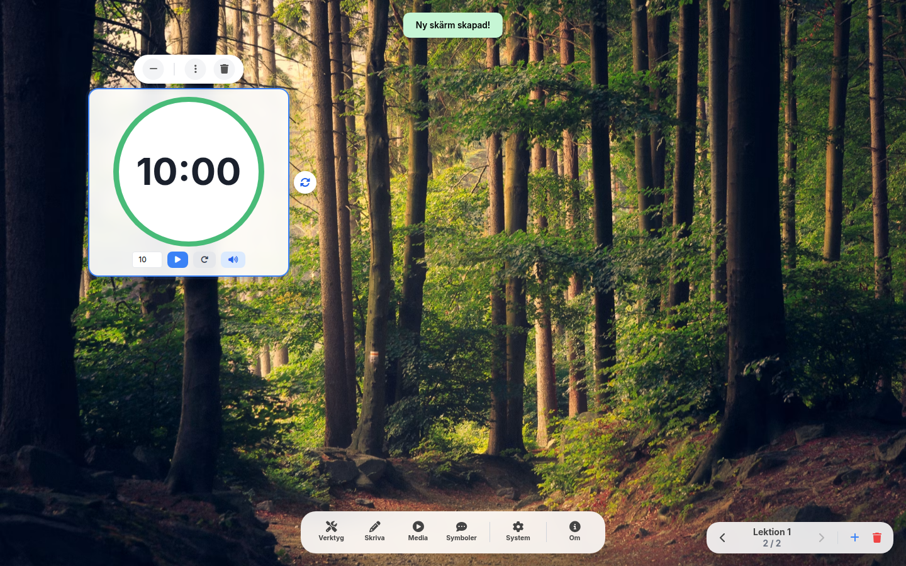

**Användning:** Nedräkning för aktiviteter, stationer eller raster.

**Så här gör du:**
1. Verktyg → Timer
2. Skriv in antal minuter i rutan (t.ex. `10`)
3. Klicka **▶** (play) för att starta
4. Klicka **↺** (återställ) för att börja om
5. Klicka **🔊** för att slå på/av ljudsignal när tiden är ute

Den gröna cirkeln krymper allteftersom tiden går.

**Tips:** Sätt timern på 5 minuter vid grupparbete så att eleverna ser hur mycket tid som återstår.

---

### Tidtagarur

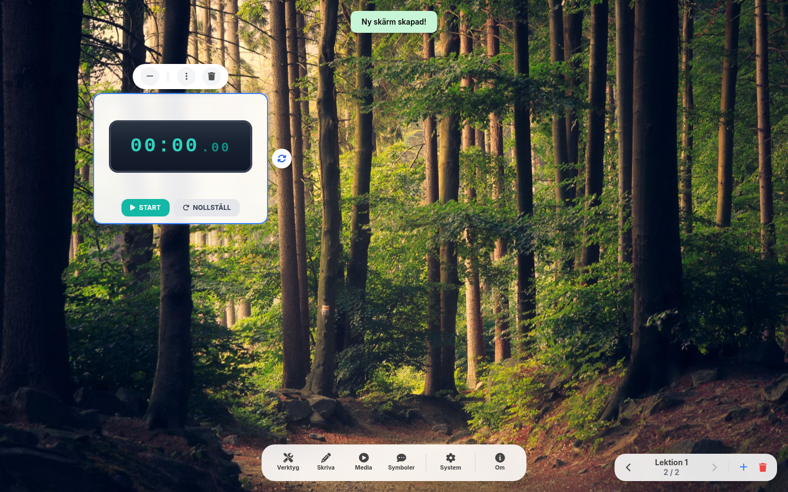

**Användning:** Mäta hur lång tid något tar.

**Så här gör du:**
1. Verktyg → Tidtagarur
2. Klicka **START** för att börja mäta
3. Klicka igen för att pausa
4. Klicka **NOLLSTÄLL** för att återställa till 00:00

---

### Ljudnivå

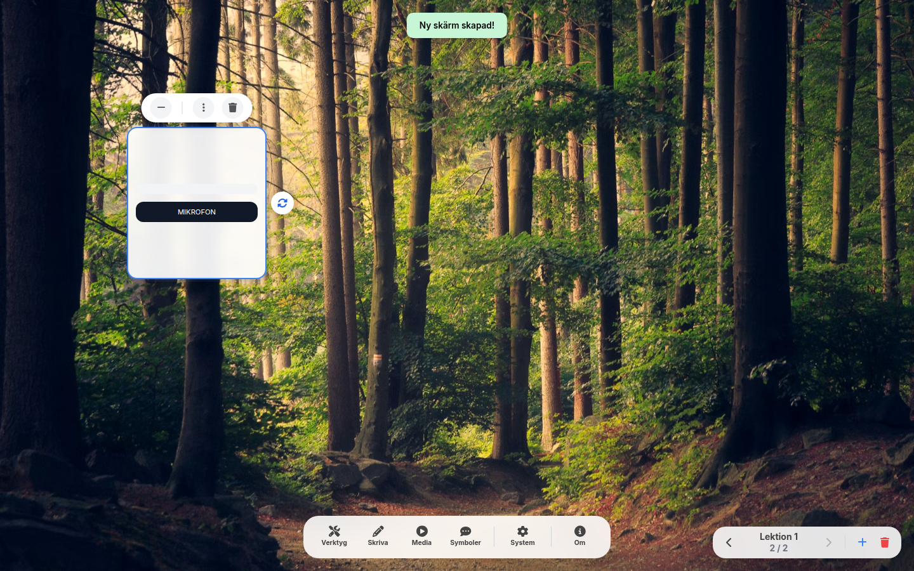

**Användning:** Visa klassrummets ljudnivå visuellt – bra för att träna eleverna i att hålla lagom volym.

**Så här gör du:**
1. Verktyg → Ljudnivå
2. Klicka **MIKROFON**
3. Webbläsaren frågar om tillåtelse – klicka **Tillåt**
4. En färgad stapel visar ljudnivån (grönt = tyst, rött = högt)

**Tips:** Placera widgeten synligt och utmana klassen: "Kan vi hålla stapeln grön?"

---

### Slump (elevslumpare)

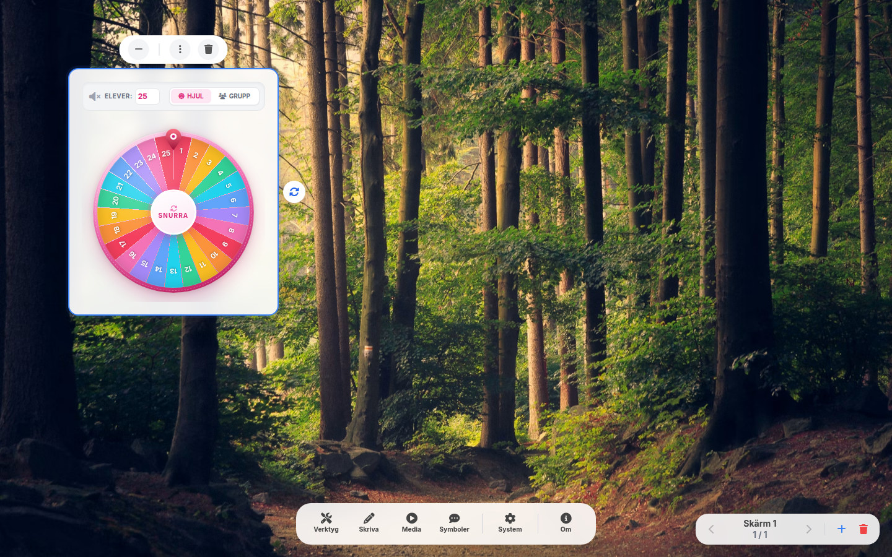

**Användning:** Slumpa fram elevnummer eller skapa slumpmässiga grupper.

**Så här gör du – Hjul-läge:**
1. Verktyg → Slump
2. Ange antal elever i fältet **ELEVER** (t.ex. `25`)
3. Klicka **SNURRA** i mitten av hjulet
4. Hjulet snurrar och stannar på ett nummer

**Så här gör du – Grupp-läge:**
1. Klicka **GRUPP** högst upp i widgeten
2. Ange **GRUPPSTORLEK** (t.ex. `4`)
3. Klicka **SKAPA**

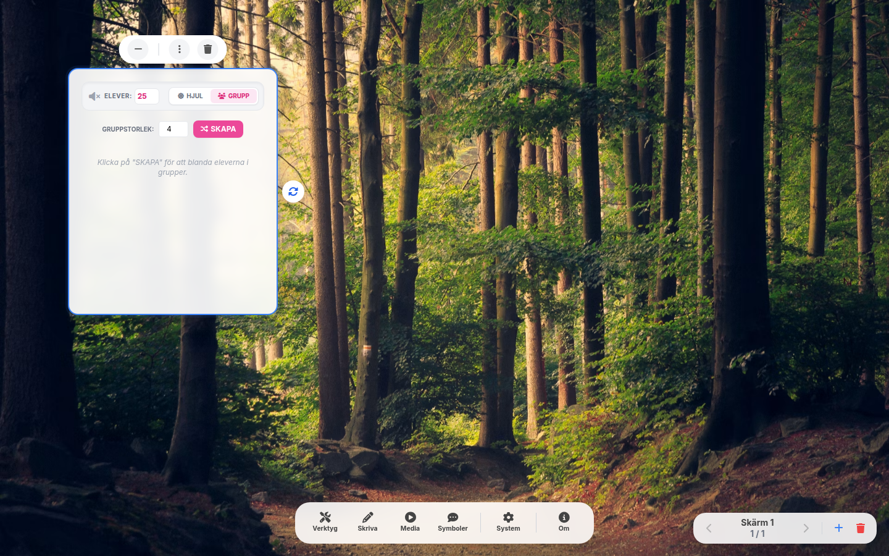

**Tips:** Slå på ljudet med högtalarikonen om du vill ha ljudeffekt vid snurrning.

---

### Tärningar

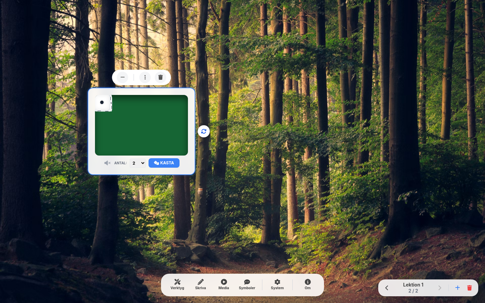

**Användning:** Slumpa tal i matematiklektionen eller spel.

**Så här gör du:**
1. Verktyg → Tärningar
2. Välj antal tärningar (1–6) i rullgardinsmenyn
3. Klicka **KASTA** eller klicka direkt på tärningsytan
4. Tärningarna rullar och visar nya värden

---

## 6. Skriva – detaljerad guide

### Notering

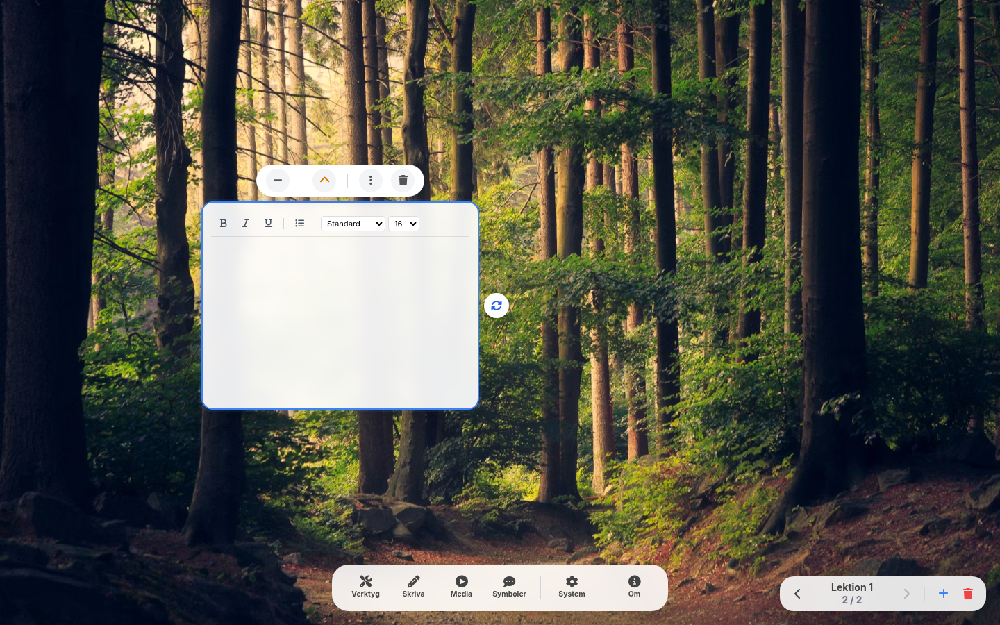

**Användning:** Skriv instruktioner, mål eller meddelanden till klassen.

**Så här gör du:**
1. Skriva → Notering
2. Klicka i textfältet och skriv
3. Använd verktygsraden för formatering:
   - **B** = fetstil
   - **I** = kursiv
   - **U** = understruken
   - Punktlista
   - Teckensnitt och storlek

**Tips:** Skriv "Dagens mål:" i fetstil och placera widgeten högst upp på skärmen.

---

### Att göra

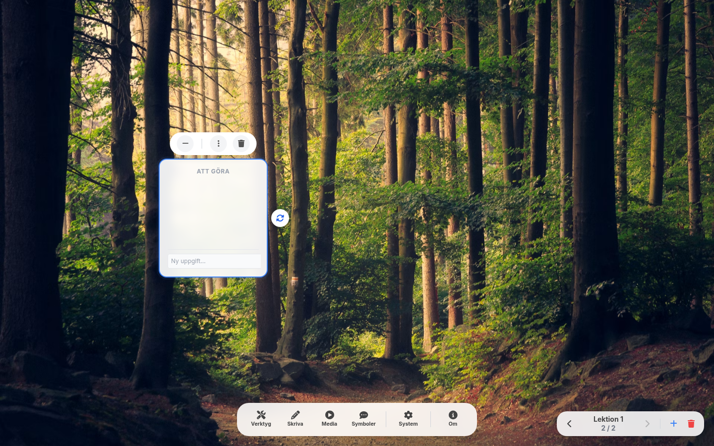

**Användning:** Checklista som eleverna kan följa under lektionen.

**Så här gör du:**
1. Skriva → Att göra
2. Skriv en uppgift i textfältet längst ner
3. Tryck **Enter** eller klicka **+**
4. Klicka på en uppgift för att markera den som klar (bockas av)

---

### Schema

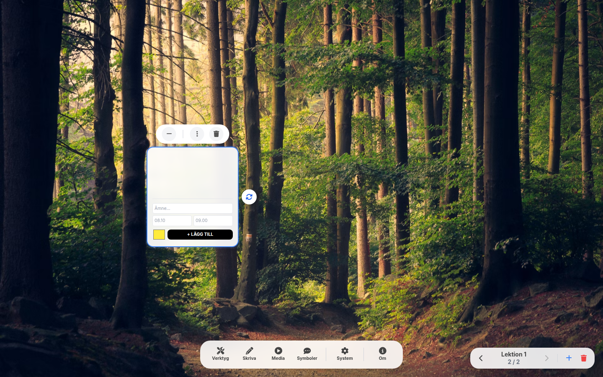

**Användning:** Visa dagens eller lektionens schema med tider.

**Så här gör du:**
1. Skriva → Schema
2. Fyll i **Ämne** (t.ex. "Matematik")
3. Ange **starttid** och **sluttid** (t.ex. `08.10` och `09.00`)
4. Välj en färg med färgväljaren
5. Klicka **+ LÄGG TILL**
6. Upprepa för fler lektioner

Varje tillagd lektion visas i en färgkodad rad ovanför.

---

## 7. Media – detaljerad guide

### Bild

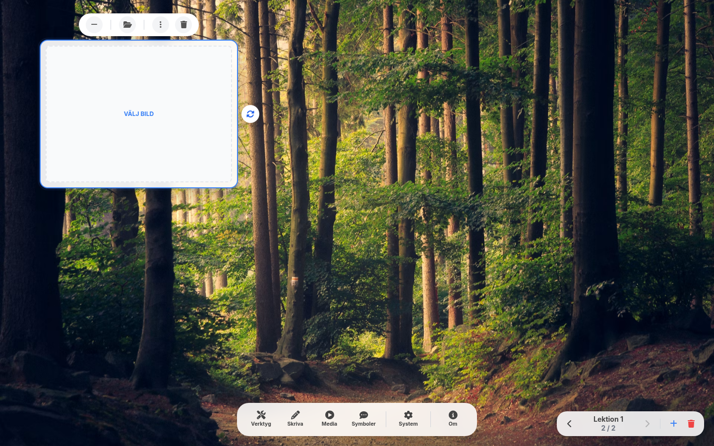

1. Media → Bild
2. Klicka **VÄLJ BILD**
3. Välj en bildfil från din dator
4. Bilden visas i widgeten – ändra storlek efter behov

### Video

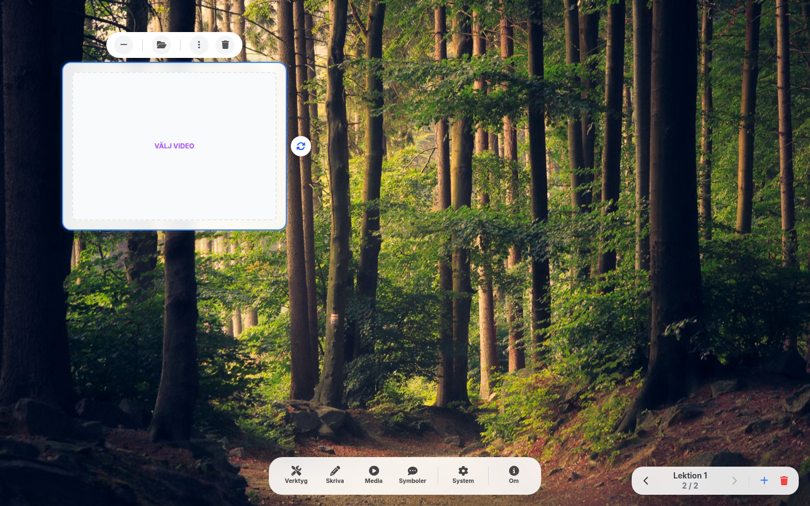

1. Media → Video
2. Klicka **VÄLJ VIDEO**
3. Välj en videofil från din dator

### PDF

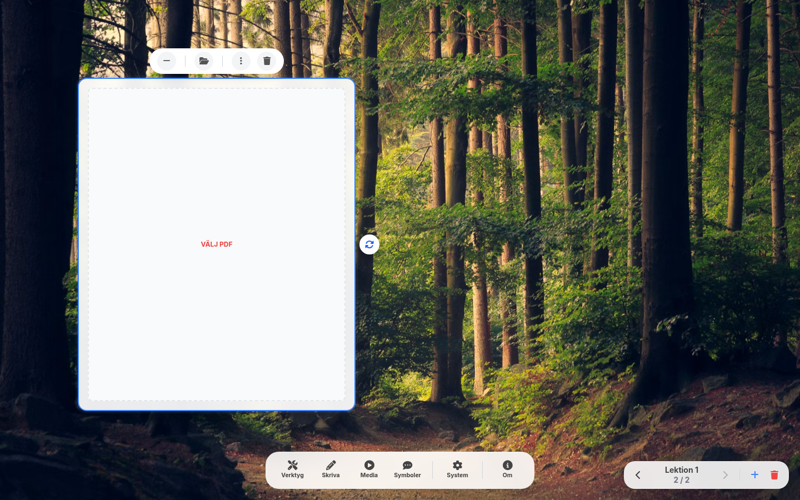

1. Media → PDF
2. Klicka **VÄLJ PDF**
3. Välj en PDF-fil – den visas direkt i widgeten

### Spotify

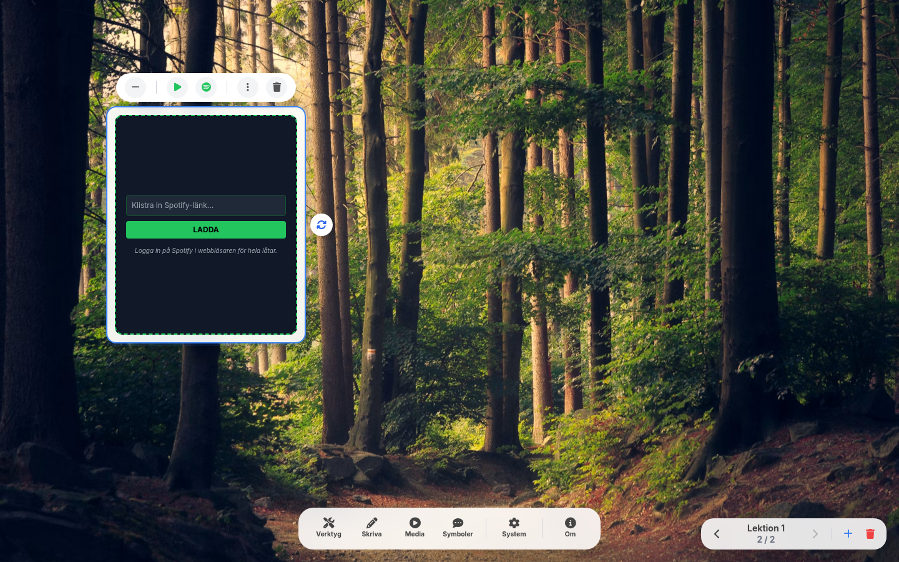

1. Media → Spotify
2. Kopiera en Spotify-länk (låt, album eller spellista)
3. Klistra in länken och klicka **LADDA**
4. Använd play-knappen i verktygsraden för att styra uppspelningen

**Obs:** Du behöver vara inloggad på Spotify i webbläsaren för att spela hela låtar.

### YouTube

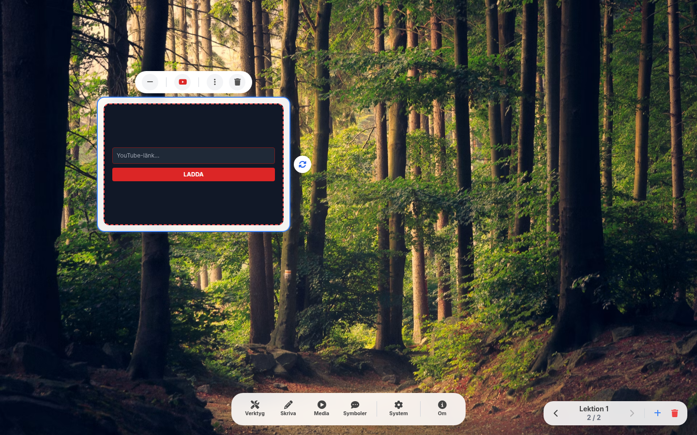

1. Media → YouTube
2. Klistra in en YouTube-länk
3. Klicka **LADDA**
4. Videon visas i widgeten

---

## 8. Symboler – detaljerad guide

Symboler hjälper dig att ge tydliga, visuella instruktioner till klassen utan att behöva säga något.

### Färdiga symbolspråk

| Symbol | Betydelse | Bild |
|--------|-----------|------|
| **Tyst** | Eleverna ska vara helt tysta | 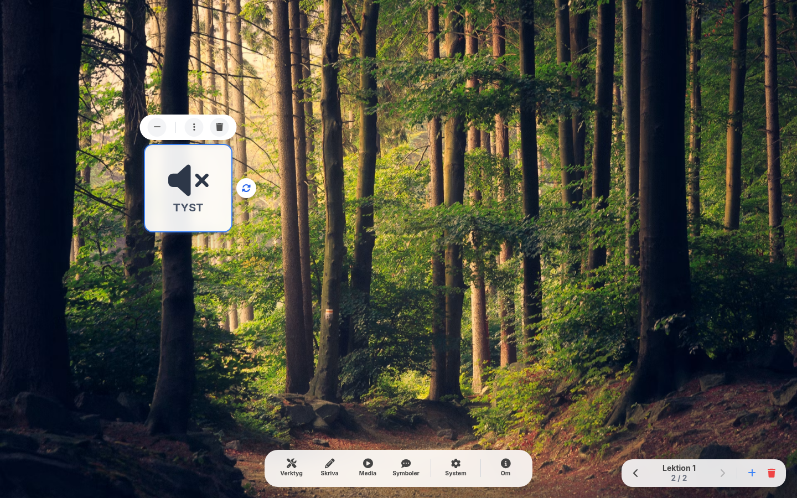 |
| **Viska** | Eleverna får viska | (se menyn Symboler) |
| **Granne** | Prata med personen bredvid | (se menyn Symboler) |
| **Grupp** | Arbeta i grupp | (se menyn Symboler) |

**Så här gör du:**
1. Symboler → välj symbol
2. Placera symbolen synligt på skärmen
3. Byt symbol när aktiviteten ändras

### Pilar

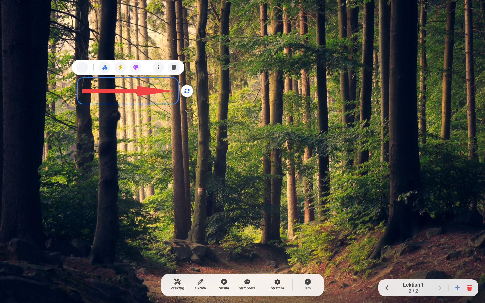

**Användning:** Peka ut saker på skärmen, tavlan eller i rummet.

**Så här gör du:**
1. Symboler → Pilar
2. Använd verktygsraden för att:
   - Byta **form** (flera pilvarianter)
   - Slå på **animation** (pulserande effekt)
   - Välja **färg**

### Sök bild (ARASAAC)

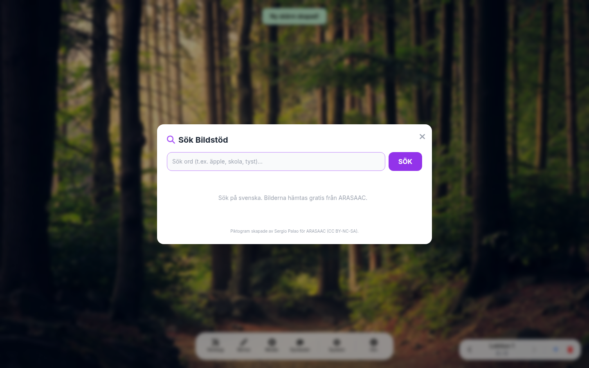

**Användning:** Hitta och lägga till bildstöd (piktogram) från ARASAAC – gratis material för kommunikation och bildstöd.

**Så här gör du:**
1. Symboler → Sök bild
2. Skriv ett sökord på svenska (t.ex. "äpple", "skola", "tyst")
3. Klicka **SÖK**
4. Klicka på en bild för att lägga till den på skärmen

---

## 9. System – detaljerad guide

### Bakgrund

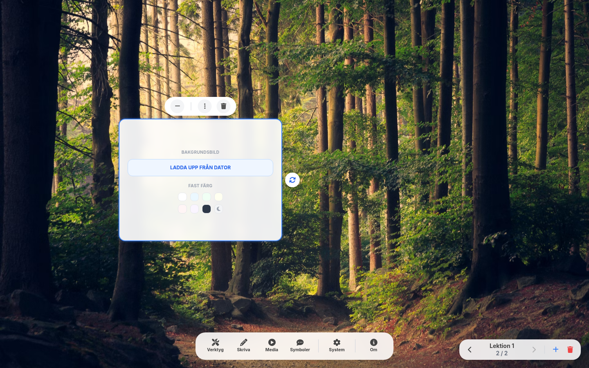

**Så här gör du:**
1. System → Bakgrund (eller lägg till Bakgrund-widgeten)
2. Välj antingen:
   - **LADDA UPP FRÅN DATOR** – egen bakgrundsbild
   - **Fast färg** – klicka på en färgruta

Bakgrunden gäller för den aktuella skärmen.

### Helskärm

1. System → Helskärm
2. Appen fyller hela skärmen
3. Menyerna döljs – **för musen till skärmens nederkant** för att visa dem igen
4. Tryck **Esc** eller klicka Helskärm igen för att avsluta

### Spara och öppna fil

Se avsnitt [11. Spara och återanvända](#11-spara-och-återanvända).

### Rensa minnet

1. System → Rensa minnet
2. Bekräfta i dialogrutan
3. Allt raderas och appen laddas om

**Varning:** Detta går inte att ångra. Spara din layout till fil först om du vill behålla den.

---

## 10. Flera skärmar

Du kan skapa flera skärmar (sidor) – till exempel en skärm per lektionsmoment.

### Skapa en ny skärm

1. Klicka på **+** i skärmnavigeringen (nere till höger)
2. En ny tom skärm skapas
3. Ge skärmen ett namn i namnfältet (t.ex. "Intro", "Grupparbete", "Avslutning")

### Växla mellan skärmar

- Klicka **◀** eller **▶** i skärmnavigeringen
- Varje skärm har sina egna verktyg och bakgrund

### Ta bort en skärm

1. Navigera till skärmen du vill ta bort
2. Klicka på **🗑** i skärmnavigeringen
3. Bekräfta i dialogrutan

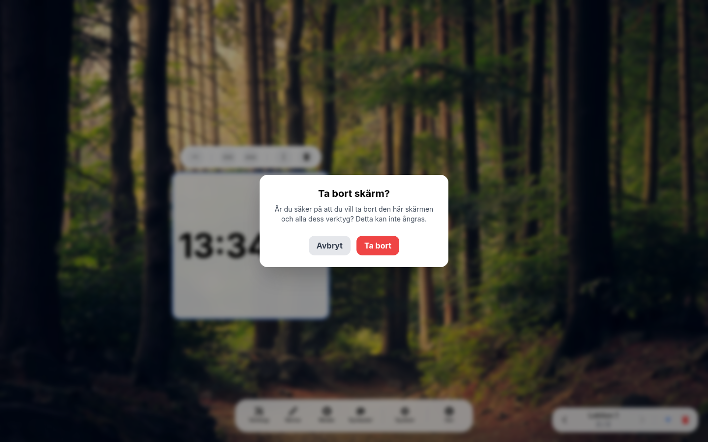

**Obs:** Du kan inte ta bort den sista skärmen.

---

## 11. Spara och återanvända

Appen sparar automatiskt ditt arbete i webbläsarens minne (localStorage). När du öppnar appen igen i samma webbläsare finns dina skärmar kvar.

### Spara till fil (rekommenderas)

För att säkert spara och kunna använda layouten på en annan dator:

1. System → **Spara Fil**
2. En JSON-fil laddas ner till din dator (t.ex. `layout-2026-06-15.json`)
3. Döp filen tydligt, t.ex. `Matematik-år-5.json`

### Öppna sparad fil

1. System → **Öppna Fil**
2. Välj din sparade JSON-fil
3. Hela layouten laddas – alla skärmar, verktyg och inställningar

### Tips om sparning

| Situation | Rekommendation |
|-----------|----------------|
| Samma dator varje dag | Autospar räcker ofta |
| Delad dator eller flera enheter | Spara till fil regelbundet |
| Ny termin | Spara gamla layouter och skapa nya |
| Innan "Rensa minnet" | Spara alltid till fil först |

---

## 12. Tips för klassrummet

### Innan lektionen

1. **Förbered dina skärmar** – skapa en skärm per aktivitet
2. **Spara till fil** – så du inte förlorar arbetet
3. **Testa mikrofonen** om du ska använda Ljudnivå
4. **Kontrollera helskärmsläge** på projektorn

### Under lektionen

- Använd **symboler** (Tyst, Viska, Grupp) istället för att upprepa instruktioner
- Placera **timern** synligt under stationer eller skrivövningar
- Använd **slump-hjulet** för att välja elever rättvist
- **Fäll in** verktyg du inte behöver just nu (knappen **−**)

### Efter lektionen

- Spara layouten om du vill återanvända den
- Eller rensa och förbered inför nästa klass

### Kortkommandon och beteenden

| Åtgärd | Hur |
|--------|-----|
| Dölj menyer i helskärm | Menyerna visas när du för musen till skärmens nederkant |
| Avmarkera verktyg | Klicka på en tom yta på bakgrunden |
| Stäng undermeny | Klicka utanför menyn |
| Varning vid stängning | Appen varnar om du har osparade ändringar (ej exporterade till fil) |

---

## Snabbreferens

```
STARTA APPEN
  └─ Öppna index.html i webbläsaren

LÄGG TILL VERKTYG
  └─ Klicka meny (Verktyg/Skriva/Media/Symboler) → Välj verktyg

ANPASSA VERKTYG
  └─ Klicka verktyg → Dra / Ändra storlek / Rotera / Verktygsrad

FLERA SKÄRMAR
  └─ + (skapa) | ◀ ▶ (växla) | 🗑 (ta bort)

SPARA
  └─ System → Spara Fil

LADDA
  └─ System → Öppna Fil
```

---

*Klassrumsskärm är skapad av Fredrik Andersson, Skolförvaltningen Mölndal Stad. Verktyget är fritt att använda för personligt bruk i undervisningssyfte.*
